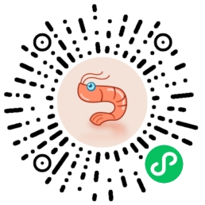
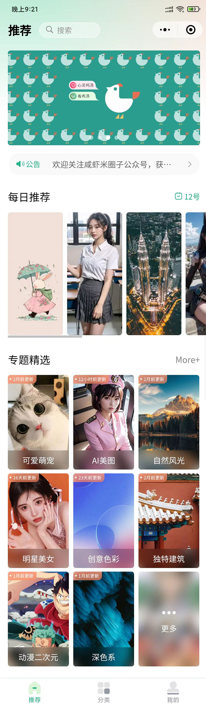
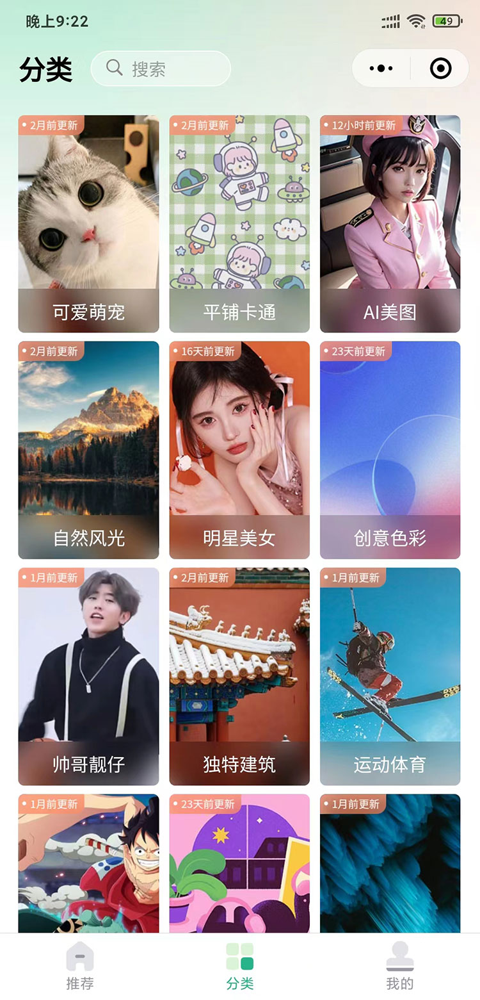

# uniapp最新Vue3组合式API版本零基础入门到项目实战

## 微信扫码体验“咸虾米壁纸”最终项目

## 课程目录+随堂笔记

### 一、开发环境及项目创建

##### 1.1.uniappVue版本知识点概述

##### 1.2.使用HBuilder编辑器创建vue3新项目

##### 1.3.配置外部浏览器及各种小程序模拟器

##### 1.4.创建页面及vue页面内基本组成部分

### 二、常用的内置组件

##### 2.1.view和text常用视图容器组件

##### 2.2.scroll-view可滚动视图区域组件

##### 2.3.swiper滑块视图容器的用法

##### 2.4.image媒体组件属性配合swiper轮播

##### 2.5.navigator路由与页面跳转

##### 2.6.常用的表单组件button和input

### 三、vue3组合式API快速上手

##### 3.1.vue3的模板语法插值表达式用法

##### 3.2.使用ref定义响应式数据变量

##### 3.3.v-bind指令配合图片轮播案例

##### 3.4.class类和style内联样式的绑定

##### 3.5.原生事件监听及组件内置事件处理

##### 3.6.创建自定义模板快速创建uniapp的vue3页面结构

##### 3.7.v-if条件渲染及v-show的选择对比

##### 3.8.v-for列表渲染的用法

##### 3.9.【购物车案例】for循环为什么使用key

##### 3.10.【小鸡案例】表单focus和blur事件用法

##### 3.11.v-model双向绑定的实现原理

##### 3.12.【热梗案例】知识点阶段性综合汇总

##### 3.13.computed计算属性用法及方法对比

##### 3.14.【案例】计算属性配合循环遍历统计总价

拓展阅读：[各种类型的for循环遍历](https://blog.csdn.net/qq_18798149/article/details/135089225)

##### 3.15.watch和watchEffect监听的使用

拓展阅读：[vue3中computed计算属性和watch监听的异同点](https://blog.csdn.net/qq_18798149/article/details/135302780)

### 四、深入vue组件及生命周期

##### 4.1.uniapp创建组件和vue官方文档的差异对比

##### 4.2.在组件中通过Props进行数据传递

##### 4.3.Prop校验与prop默认值用法及循环遍历数组对象

##### 4.4.插槽Slots及具名插槽实现组件高度定制化

##### 4.5.组件中emit的声明触发事件

##### 4.6.vue3组合式API中的组件的生命周期函数（钩子函数）

拓展阅读：[uniappVue3版本中组件生命周期和页面生命周期的详细介绍](https://blog.csdn.net/qq_18798149/article/details/135405378)

##### 4.7.使用defineExpose暴漏子组件的属性及方法

##### 4.8.页面生命周期onLoad和onReady在vue3组合式api中的使用

##### 4.9.onShow和onHide钩子的对比和执行顺序

##### 4.10.onUnload页面卸载和onPageScroll监听页面滚动

### 五、uniapp全局文件配置和API调用

##### 5.1.响应式单位rpx及搭配使用UI产品工具

##### 5.2.@import导入css样式及scss变量用法与static目录

##### 5.3.pages.json页面路由globalStyle的属性

##### 5.4.pages设置页面路径及窗口表现

##### 5.5.tabBar设置底部菜单选项及iconfont图标

##### 5.6.manifest.json配置和注册微信小程序appid

##### 5.7.安装插件unplugin-auto-import自动导入vue和uniapp模块

使用说明：[开发uniapp使用Vue3组合式API版本，如何实现从vue模块中自动导入](https://blog.csdn.net/qq_18798149/article/details/134321097)

##### 5.8.uni-api交互反馈showToast的用法

##### 5.9.showLoading加载和showModal模态框示例

##### 5.10.showActionSheet从底部向上弹出操作菜单

##### 5.11.动态设置页面导航条的样式

##### 5.12.setTabBar设置TabBar和下拉刷新API

##### 5.13.页面和路由API-navigateTo及页面栈getCurrentPages

##### 5.14.StorageSync数据缓存API

##### 5.15.uni.request发送网络请求

免费测试api接口：https://jsonplaceholder.typicode.com/

随机猫咪API接口：https://api.thecatapi.com/v1/images/search?limit=1

咸虾米API接口：https://api.qingnian8.com/

NBA球员榜：https://tiyu.baidu.com/api/match/playerranking/match/NBA/tabId/60

##### 5.16.request各种不同类型的参数详解

### 六、阶段性综合小实例-萌宠集

##### 6.1.页面布局

##### 6.2.调用萌宠API接口渲染到页面中

##### 6.3.使用API接口通过传输头传递access-key

##### 6.4.previewImage图片预览和lazy-load懒加载

##### 6.5.对回调结果严格处理then_catch_finally用法

##### 6.6.完成下拉刷新和触底加载更多

##### 6.7.底部安全区域css环境变量

`env(safe-area-inset-bottom)`

##### 6.8.使用uni-ui扩展组件

##### 6.9.分段器组件实现点击切换萌宠类型

### 七、咸虾米壁纸项目实战

##### 7.1.咸虾米壁纸项目概述

##### 7.2.项目初始化公共目录和设计稿尺寸测量工具

##### 7.3.banner海报swiper轮播器

##### 7.4.使用swiper的纵向轮播做公告区域

##### 7.5.每日推荐滑动scroll-view布局

##### 7.6.组件具名插槽定义公共标题模块

##### 7.7.细节拉满磨砂背景定位布局做专题组件

##### 7.8.同一组件Props传递不同属性值展示不同效果

##### 7.9.设置项目底部tab页面切换标签

##### 7.10.个人中心页面布局

##### 7.11.ifdef条件编译实现多终端匹配和客服消息

##### 7.12.设置页面全局渐变线性渐变背景色

##### 7.13.定义scss颜色变量deep()修改子组件css样式

##### 7.14.创建分类列表完成各页面的跳转

##### 7.15.全屏页面absolute定位布局和fit-content内容宽度

##### 7.16.遮罩层状态转换及日期格式化

##### 7.17.uni-popup弹窗层制作弹出信息内容效果

##### 7.18.评分弹出框uni-rate组件的属性方法

##### 7.19.自定义头部导航栏布局

##### 7.20.获取系统信息getSystemInfo状态栏和胶囊按钮

##### 7.21.抽离公共方法用条件编译对抖音小程序适配

##### 7.22.完善页面布局实现各个页面的串联

### 八、封装网络请求对接各个页面的真实接口

##### 8.1.调用网络接口在首页展示真实数据并渲染

##### 8.2.使用Promise封装request网络请求

##### 8.3.request函数传递参数

##### 8.4.对接专题分类API接口结合AI智能写工具方法

##### 8.5.分类列表接口对接页面传参跳转

##### 8.6.分类列表页面触底加载和下拉刷新

##### 8.7.展现页面加载前的骨架屏插件

##### 8.8.通过缓存实现页面间跳转的传值

##### 8.9.完善预览页面各种交互效果

##### 8.10.实现我的评分功能

##### 8.11.壁纸下载将云端图片存储到本地相册

##### 8.12.页面销毁生命周期函数在项目中的使用

##### 8.13.对接个人中心API接口

##### 8.14.共用分类列表页面做特殊化处理

##### 8.15.分享给好友和发布到朋友圈

##### 8.16.搜索页面结构布局

##### 8.17.完成搜索展现功能

##### 8.18.实现公告页面的数据展现解析富文本文档

### 九、常用的多个平台的打包上线

##### 9.1.通过unicloud的web托管实现H5的打包上线

##### 9.2.打包微信小程序并发布上线

##### 9.3.打包抖音小程序使用条件编译做兼容

##### 9.4.打包APP上传云端统一发行

##### 9.5.【完结撒花】项目总结

##  学习交流群

咸虾米QQ群：247369155

## 项目预览图

-----------------------------------

---------------------------------------

